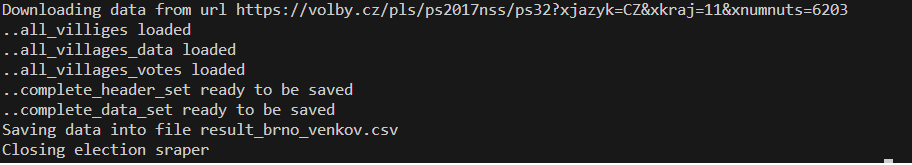

# EngetoProject3_Election_scraper

## About
Election scraper is designed to scrape election data from a web [Volby.cz](https://volby.cz/pls/ps2017nss/ps3?xjazyk=CZ). Scraper is designed to scrape data from the year 2017. Scraped data are stored as csv file and can be used for further data analysis. Application uses 3rd party libraries, and all packages are stored in a configuration file requirements.txt.

## Installation

Download file main.py and requirement.txt. Open a tool supporting to run .py files. Install configuration file "requirements.txt" using command pip install -r requirements.txt.  

## Data scraping
File "main.py" can be triggered from command line using 2 arguments. Once the command line is opened write "python", name of a file "main.py" and write two arguments. First argument is URL of a chosen district [here](https://volby.cz/pls/ps2017nss/ps3?xjazyk=CZ). The second argument is the name of file where data will be stored "result_tab.csv". Order of arguments must be kept as written. Once the scraping is completed the program is closed.

**_Voting results for district Brno-venkov:_**

__Arguments__  
1. argument = https://volby.cz/pls/ps2017nss/ps32?xjazyk=CZ&xkraj=11&xnumnuts=6203
1. argument = result_tab.csv

__Starting the program:__  
python main.py https://volby.cz/pls/ps2017nss/ps32?xjazyk=CZ&xkraj=11&xnumnuts=6203 result_tab.csv

__Scraping progress:__  

__Scraping result example

